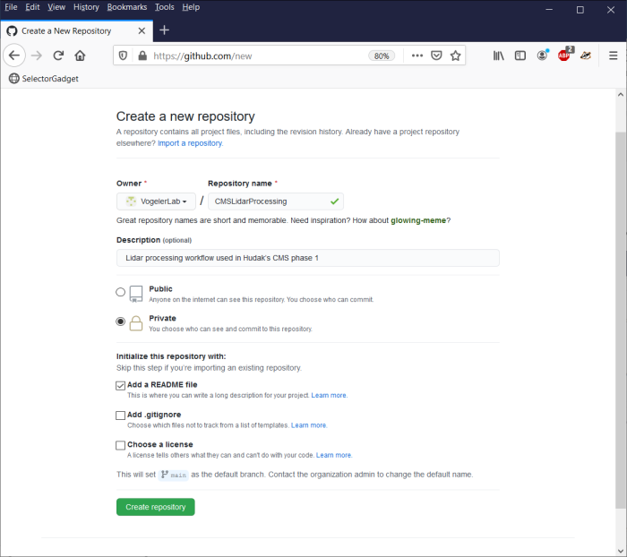
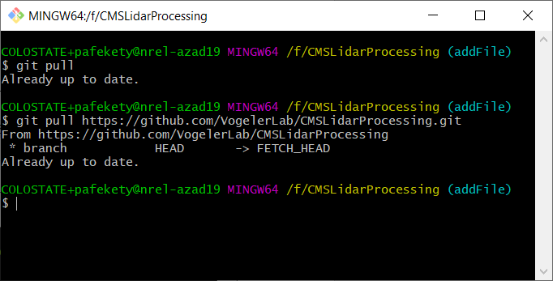
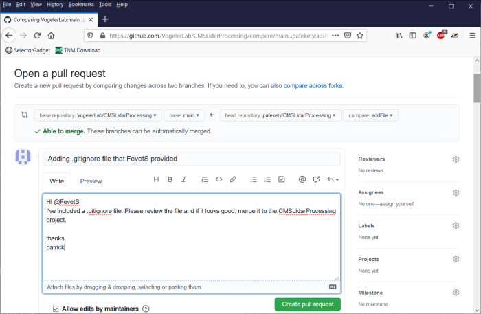

# Using Git and GitHub in the Vogeler Lab

## Git vs GitHub
Git is a version control software.
GitHub is an online repository for code that is based on Git.

Git keeps tracks changes to files and allows you (or others) to view changes and revert changes.
Git also allows you (or others) to copy all the files in a repository, make changes, and submit those changes back to the main repository

Do not put code into a sync service folder (like Google Drive) when cloning locally. Occasionally lead to corruption of the repo (https://stackoverflow.com/questions/42837746/why-is-google-drive-deleting-my-git-files)

Git Bash is a unix-style command window. 
List of some useful commands

`ls -a` #list all files in directory  
`cd` # change directory  
`~` # this is a shortcut to your root directory, e.g., cd ~  
`pwd` #prints working directory  
`touch temp.txt` #create a new (empty) file named temp.txt  
`rm temp.txt` #deletes the file named temp.txt  
`clear` #clears the console


In the Vogeler Lab, we use the Forking Workflow.

<span style="text-decoration: underline">Random  Terms</span>  
Repo - Repository. A data space to store all the files related to a project.  
Hash / SHA - This a 40-character code that identifies different versions of your project.   
HEAD - The HEAD can be understood as the "current branch." The HEAD points out the last commit in the current checkout branch.  
Local - A repository is the one on which we will make local changes, typically this local repository is on our computer.  
Remote - A repository is the one of the server.  
Push - Uploading code (e.g., changes) from a local repository to a remote repository.  
Pull - Downloading code from a remote repository and automatically updates (i.e., merges) the changes to the working directory of your local repository.  
Fetch - Downloading code from a remote repository to a local repository without merging changes.  


## Forking Workflow
A developer 'forks' an 'official' server-side repository. This creates their own server-side copy.  
The new server-side copy is cloned to their local system.  
A Git remote path for the 'official' repository is added to the local clone. A new local feature branch is created.  
The developer makes changes on the new branch.  
New commits are created for the changes.  
The branch gets pushed to the developer's own server-side copy.  
The developer opens a pull request from the new branch to the 'official' repository.  
The pull request gets approved for merge and is merged into the original server-side repository.  

A developer 'forks' an 'official' server-side repository. This creates their own server-side copy.  
The new server-side copy is cloned to their local system.  
A Git remote path for the 'official' repository is added to the local clone.  
A new local feature branch is created.  
The developer makes changes on the new branch.  
New commits are created for the changes.  
The branch gets pushed to the developer's own server-side copy.  
The developer opens a pull request from the new branch to the 'official' repository.  
The pull request gets approved for merge and is merged into the original server-side repository  


### Sources to help learning Git and GitHub  
https://www.atlassian.com/git/tutorials/comparing-workflows/forking-workflow  
https://www.dataschool.io/simple-guide-to-forks-in-github-and-git/   

## Installing Git
Git is downloaded from https://git-scm.com/downloads  


Download the appropriate installer and run.

You can accept the default settings; however, there is one change you should consider. It is not necessary to adjust the PATH environment. Instead, opt for the “use Git Bash” only option.  

 

Open Git Bash, which is the command window that we will use. It looks like this:  


First, let’s make some changes to how Git is configured. Git has three levels that can be configured: system (affecting everybody on the computer), global (affecting only you), local (affecting a specific project). Let’s configure the global settings. First we want to know who you are – we will change the global configuration settings. In the command window, type:  
```git config --global user.name your-name```  
```git config --global user.email your-email-address```  


If you want to change the default text editor used by git, type:  
```git config --global core.editor "notepad.exe"```

to view all the configuration settings, type:  
`git config –list`

To view which directory you are currently in, print the working directory (this is not a git command, but GitBash command)
`pwd`

use `cd` to change directories

## Starting a new project on VogelerLab
Log on to GitHub and navigate to the VogelerLab organization  

### Create the new repository  


Assign the project’s name and give it a brief description, for example: Lidar processing workflow used in Hudak’s CMS phase 1  
 

## Forking a repo to your personal GitHub account
We need to Fork the CMSLidarProcessing repo to our personal GitHub account. On the VogelerLab account, and inside the project you want to copy, find and press the fork button.
 

Now you have a copy of the VogelerLab repo on your personal GitHub account. 
 

Ok, but now we want to make some changes to this project. The change were are going to make is add a new file to the project, specifically a .gitignore file. Currently, the project is on GitHub, so we need to create a copy on our local computer.

Open Git Bash  
Let’s download a copy of the repository to our local machine so we can make changes. This will create a clone of the GitHub repo. In the Git Bash terminal, change directories to where you want the coned repo to live. I’ll choose the F-drive.  
`cd F:`  
We need the URL to your local repo. (See previous figure)  
git clone https://github.com/pafekety/CMSLidarProcessing.git  
(you may be prompted to log into github)  
  

Looking at the F-drive, I now have the readme.md and the .git folder (which is normally hidden)
  

CD into local repro.  
`cd CMSLidarProcessing`  

Check status.  
`git status`

See what files are in the directory.  
`ls -a`  
  

## Create a new branch
We are going to create a new branch so that we can make changes that don’t affect our local repository. If we end up liking the changes, we can merge them back to our main branch. Let’s call the new branch “addFile”, because we will add a new file to the project.  
`git branch addFile`  
`git branch --all`  
`git checkout addFile`  


`git branch --set-upstream-to origin addFile`  


Let’s make a change to the repo on our local computer by adding a new file. Here we are going to add a .gitignore file that tells git which files to not track. Add the .gitignore file to the directory. Here, I just copied and pasted into the folder.  

Use the GitBash to verify the file is present. And use the command git status to verify that git recognized the change to the repro.  


At this point git is aware of the change but isn’t tracking the .gitignore file. We need to add the .gitignore file to the staging area. Type: `git add .gitignore`  


Our last step is to commit changes to the local repository. Committing takes a snapshot of the repro and will record the steps necessary to undo any changes. With every commit, we need to add a message.  
`git commit -m "Adding .gitignore file that FevetS provided"`  
`git status`  


## Upload these changes to GitHub.

First run `git pull` to make sure your personal GitHub repo hasn’t changed. It is very unlikely that your repo has change, but it is still good practice. But what’s more likely, the version on VogelerLab might have changed. 
So run `git pull https://github.com/VogelerLab/CMSLidarProcessing.git`  

 
Now all three copies (local machine, personal GitHub repo, and VogelerLab repo) are up to date. 

We push our addFile branch (with changes) to our personal GitHub repository.  
`git push --set-upstream origin addFile`  


And now if we go back to GitHub, we’ll see our changes on our personal GitHub account. You notice there’s a new branch named “addFile”.  
  

Switch to the “addFiles” branch. The file .gitignore is included in this branch.  
 

## Update the VogelerLab repo

On your personal GitHub page, navigate to the project (e.g., CMSLidarProcessing). We need to initiate a new pull request. Doing so will allow your updates to be integrated into the VogelerLab project.  
Navigate to the Pull requests tab. Start a new pull request.  
You want to compare across forks - the base repository is VogelerLab (and the base branch is main) and the HEAD repository is your personal repro (and the compare branch is “addFile”).  
  

Create the pull request.
Type a message. You can tell GitHub to send a message to a specific maintainer by using @ and their handle. E.g., @FevetS
  

Now one of the maintainers will look at the pull request and determine whether or not to accept the change.
  
  

You will see the .gitignore file has been added to the main GitHub page for the project.  
You can now delete the branch from your personal GItHub account, if you want.  


On your personal GitHub account, you will see that your project is behind the original, in this case, 2 commits behind. Closer inspection shows that the first commit was adding the .gitignore on your local computer and the second commit was the merge from the pafekety:addFiles branch to VogelerLab:main. 
  

You could either use GitHub to bring your personal branch up to date by initiating a pull request and accepting the merge or in Git Bash  
`git remote add upstream git://github.com/VogelerLab/CMSLidarProcessing.git`
